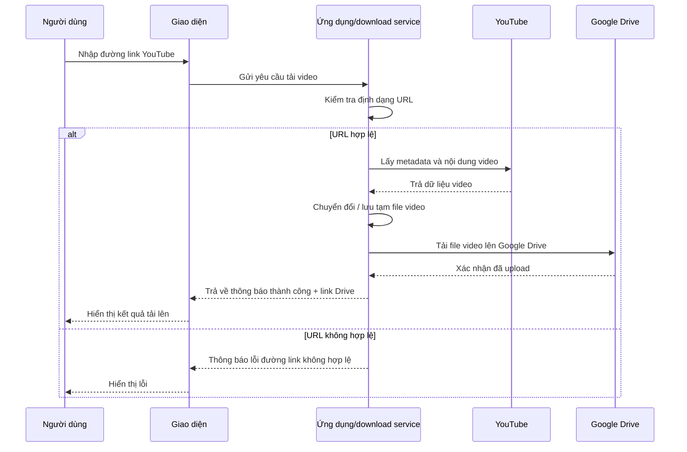

# Sequence Diagram: Download YouTube Video to Google Drive

```mermaid
sequenceDiagram
    participant User as Người dùng
    participant UI as Giao diện
    participant App as Ứng dụng/download service
    participant YouTube as YouTube
    participant Drive as Google Drive

    User->>UI: Nhập đường link YouTube
    UI->>App: Gửi yêu cầu tải video
    App->>App: Kiểm tra định dạng URL
    alt URL hợp lệ
        App->>YouTube: Lấy metadata và nội dung video
        YouTube-->>App: Trả dữ liệu video
        App->>App: Chuyển đổi / lưu tạm file video
        App->>Drive: Tải file video lên Google Drive
        Drive-->>App: Xác nhận đã upload
        App-->>UI: Trả về thông báo thành công + link Drive
        UI-->>User: Hiển thị kết quả tải lên
    else URL không hợp lệ
        App-->>UI: Thông báo lỗi đường link không hợp lệ
        UI-->>User: Hiển thị lỗi
    end
```
